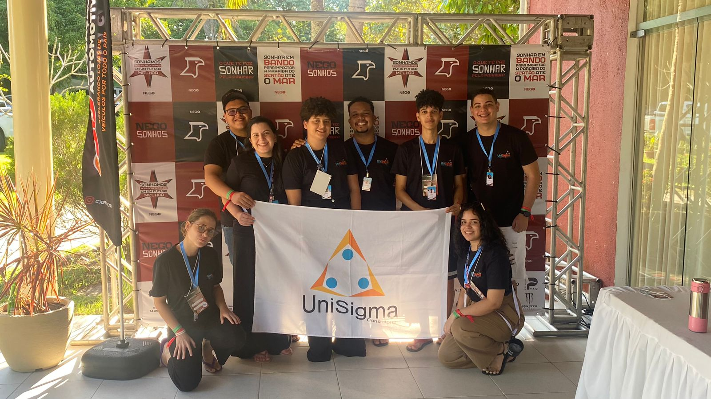

# 🦁 UniSigma - Empresa Junior de Administração e Sistemas para Internet do IFPB

Com sede de empreender e entregando soluções que impactam o mercado positivamente, nós, da Unisigma, estamos aqui para garantir que a tecnologia não seja uma barreira, mas sim uma ferramenta acessível e eficaz para você, sua equipe e seu negócio.

## 🛠️ Conhecça nossos serviços

Oferecemos diversos serviços que sua empresa pode necessitar como:

- Marketing
- Estruturação Financeira
- Planejamento Estratégico
- Pesquisa de Mercado
- Cliente Oculto
- Customer Experience
- Desenvolvimento de Sites
- Sistema de Agendamento
- Sistema de Gestão
- Sistema de Menu Digital

Conheça nosso [site oficial](https://unisigma.onrender.com/) para saber mais sobre nossos serviços e nossa história.

## ☎️ Contato

Caso queira entrar em contato, aqui estão algumas de nossas redes:

- <a href="https://wa.me/5583986690647?text=Ol%C3%A1%2C+preciso+tirar+algumas+duvidas.">WhatsApp</a>

- <a href="tel:(83) 98669-0647">Telefone</a>
- <a href="mailto:comercialunisigma@gmail.com?subject=PLANEJAMENTO%20EMPRESARIAL%20%2F%20DIGITAL">E-mail</a>
